will # SOC Cockpit

[](https://github.com/ke0xes)
[](https://github.com/cisco-open/SOC-Cockpit/commits/main)
[](https://github.com/cisco-open/SOC-Cockpit/blob/main/LICENSE)
[](CODE_OF_CONDUCT.md)
[](https://opensource.cisco.com)


SOC Cockpit is a web-based operational command console for SOC (Security Operations Center) managers. It is designed around dense, shared operations
workflows rather than a single-user desktop shell.

## Screenshots

> The screenshots below use a fictional **"Meridian Global SOC"** dataset to
> illustrate a busy, real-world operation. All names, metrics and events are
> invented for demonstration.

### Command dashboard
A one-page operational picture: SOC readiness, SLA/KPI health, live risks and
decisions, sub-team and 24/7 shift coverage, and leave/workload.

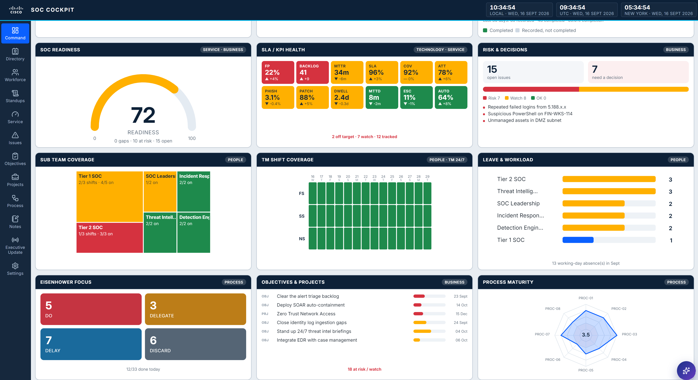

### Directory
The team and contact directory, grouped by channel — analysts, leads, vendors
and key stakeholders in one place.

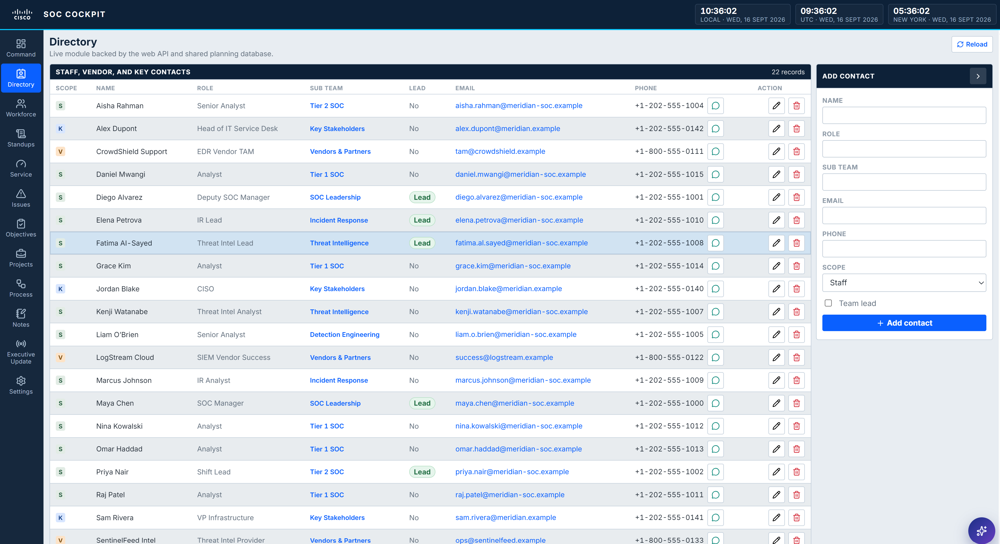

### Workforce rotation planner
Future-dated shift roster across teams, so coverage gaps surface while there is
still time to fix them.

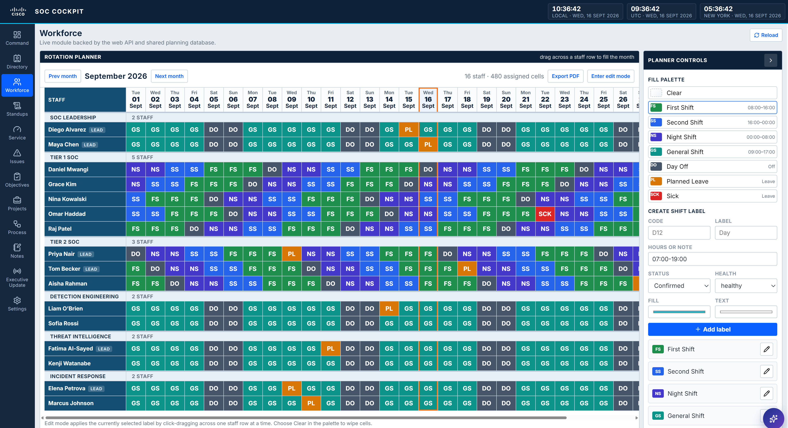

### Daily standups — Eisenhower matrix
Stand-up and stand-down tasks captured against Do / Delegate / Delay / Discard,
each with a lead, duration, status and optional link to an objective.

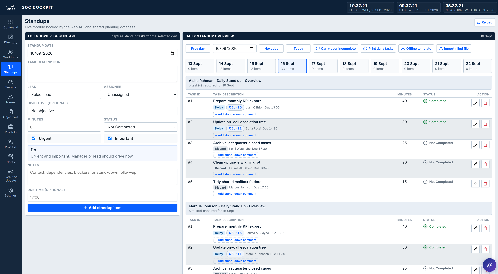

### KPI & SLA service register
KPIs and SLAs tracked continuously against target with trend and health, so
reporting becomes an export rather than a rebuild.

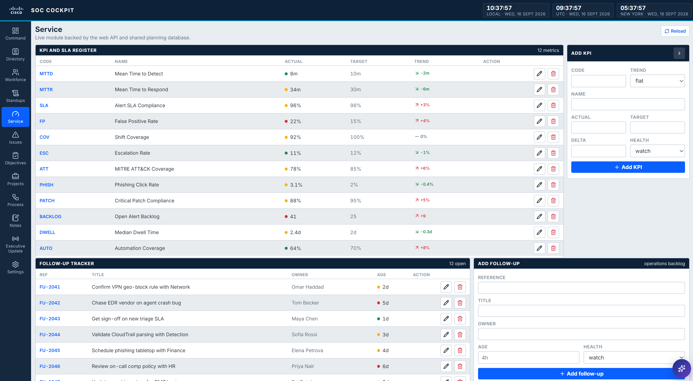

### Issue register
Operational issues with status, owner, due date and progress, colour-coded by
health so the risks stand out.

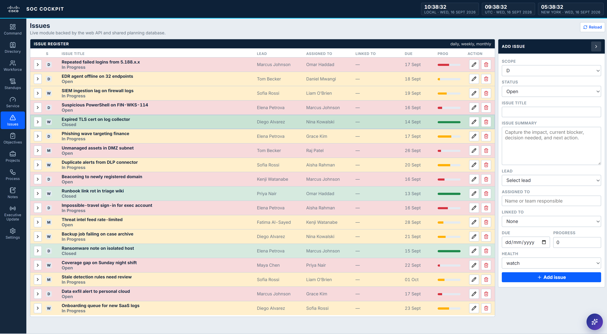

### Objectives
Objectives tracked with scope, owner, assignee, due date, progress and health —
and linked to the day-to-day tasks that move them forward.

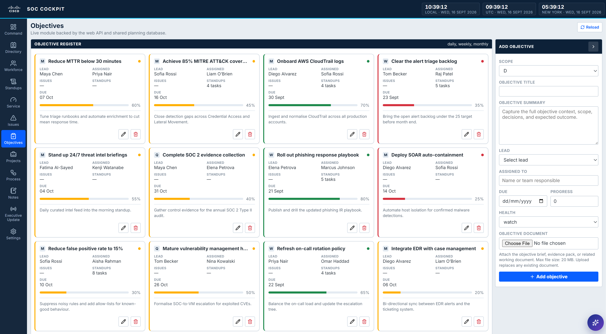

### Projects
Longer-running projects with owner, phase, due date and progress at a glance.

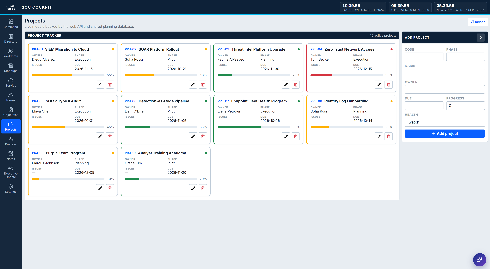

### Process inventory
The SOC's processes with owner, cadence and a maturity score, so gaps in
operational rigour are visible.

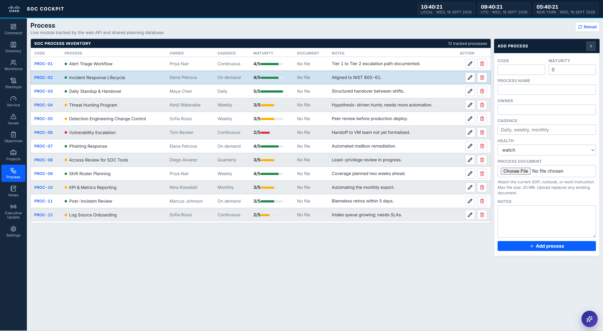

### Executive update
An automatically assembled management brief (bottom line, wins, concerns,
decisions) generated from the live cockpit data — shown here using the built-in
local fallback that works with no LLM configured.

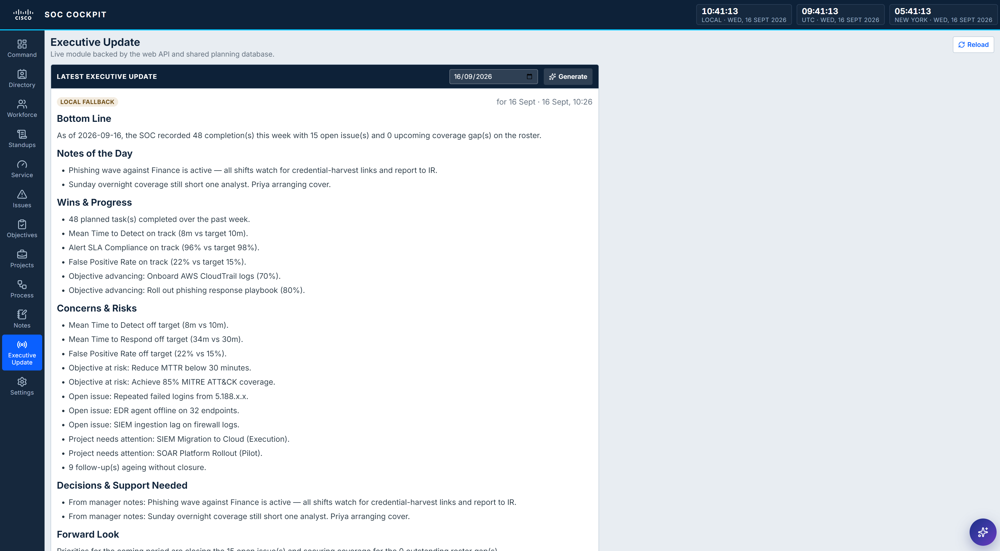

### Settings
Server and LLM status, world clocks, display preferences, and tunable SOC
readiness scoring levers.

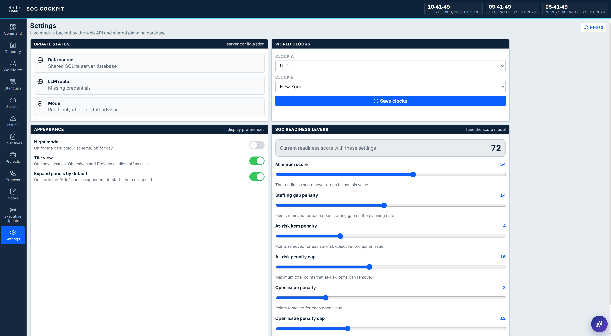

**Why it was built.** Most SOCs have mature tooling for detection and response
— a SIEM, an EDR, a SOAR, a ticketing system. Far fewer have anything for the
management layer that sits above them: who is covering the night shift next
Tuesday, what the team committed to in this morning's stand-up, which
objectives have quietly stalled, and where the evidence for this month's KPI
report is going to come from. That layer usually lives in a spreadsheet on one
manager's laptop, a chat thread, and a slide deck rebuilt from scratch every
reporting cycle. It works until the person holding it is on leave, hands over a
shift, or leaves the team. SOC Cockpit exists to give that layer a shared,
durable home.

**What it solves.** The core problem is fragmentation: the operational record
of a SOC is scattered across tools that were never meant to hold it, so nothing
is authoritative and everything is re-keyed. Stand-ups are held verbally and
lost by the afternoon, leaving no record of what was agreed or whether it was
finished. Coverage gaps are discovered on the day rather than during planning.
Objectives and issues drift without a visible owner, due date or progress
signal. Monthly reporting becomes an archaeology exercise, reconstructing weeks
of work from memory and inboxes. Cockpit replaces that with a single API-backed
store where roster, tasks, objectives, issues, KPIs, contacts and notes are
recorded once, retain their history, and stay visible to the whole team rather
than to one person.

**How SOC managers benefit.** Shift rosters are planned into the future, so
coverage gaps surface while there is still time to fix them. Daily stand-up and
stand-down tasks are captured against the Eisenhower Decision Matrix — Do,
Delegate, Delay, Discard — with a lead, duration and status on every item, and
incomplete work can be carried over rather than forgotten. Tasks link to the
objectives they serve, so it is clear which day-to-day effort is actually moving
a commitment forward and which objectives are receiving no attention at all.
KPIs, issues and follow-ups are tracked continuously instead of assembled at
month end, which turns reporting into an export rather than a rebuild. And
because stand-ups can be captured in a spreadsheet and imported later, the
process survives the days when the app is unavailable.

**Where the AI helps.** The value of an assistant in a SOC depends entirely on
whether you can trust what it tells you, so Cockpit's AI is deliberately
constrained: Keo answers strictly from the live cockpit record — roster
coverage, open issues, objectives, KPIs, stand-up tasks and notes — rather than
from general knowledge. Ask which shifts are short next week, how much effort
went into a given objective, or what is still open from last month, and the
answer comes from the data in front of you. Routine counting questions are
resolved directly from the database rather than by the model at all, so those
figures are arithmetic, not inference. Alongside this, the advisor brief turns a
day's roster, tasks, issues and KPIs into a written management summary, which
removes most of the manual effort behind daily and monthly reporting. Because
the integration targets any OpenAI-compatible endpoint, teams can point it at a
self-hosted model such as Ollama or vLLM and keep operational data entirely
inside their own environment — and if no provider is configured at all, the app
falls back to a locally generated brief and keeps working.

Features:

- A Vite + React + TypeScript frontend with a dense, ERP-style dashboard.
- An Express API with a shared SQLite backing store in `data/soc-cockpit.sqlite`.
- Future-dated shift roster planning for workforce coverage.
- Standup and standdown task management based on the Eisenhower Decision
  Matrix: Do, Delegate, Delay, and Discard.
- Operational modules for KPIs, follow-ups, assets, objectives, projects,
  contacts, notes, and advisor briefs.
- Optional AI advisor brief generation and an in-app assistant, powered by any
  OpenAI-compatible Chat Completions endpoint. Without a configured provider,
  the app falls back to a locally generated brief.
- Keo, the in-app AI SOC assistant. Keo stands for Knowledge Efficiency Operator
  and answers questions grounded only in the live cockpit data (roster coverage,
  open issues, objectives, KPIs, standup tasks, and notes).

## Prerequisites

- Node.js >= 22.5.0 (the server uses the built-in `node:sqlite` module).
- npm.

## Quick start

```bash
npm install
cp .env.example .env    # then edit values as needed
npm run dev             # start the web app and API together
```

- Web UI (dev): http://127.0.0.1:5173/
- API: http://127.0.0.1:3001/

On Windows PowerShell, use `npm.cmd` if script execution policy blocks `npm`.

## Architecture

- `src/`: web UI, API client, and module views.
- `server/app.cjs`: Express API server and production static hosting.
- `server/db.cjs`: SQLite schema, seed data, CRUD operations, and advisor brief
  generation.

## Commands

```bash
npm install
npm run dev             # start the web app and API together
npm run build           # type-check and build the frontend
npm start               # serve the production build from the API server
```

## Environment

Configuration is read from a `.env` file. Copy `.env.example` to `.env` and set
values:

| Variable          | Required | Default                     | Purpose                                             |
| ----------------- | -------- | --------------------------- | --------------------------------------------------- |
| `PORT`            | No       | `3001`                      | API / production server port.                       |
| `NODE_ENV`        | No       | `development`               | Set to `production` to serve the built frontend.    |
| `SOC_API_TOKEN`   | No       | _(unset)_                   | Optional shared token to protect the API.           |
| `OPENAI_API_KEY`  | No       | _(unset)_                   | Enables AI features. If empty, a local fallback is used. |
| `OPENAI_BASE_URL` | No       | `https://api.openai.com/v1` | Base URL of an OpenAI-compatible API.               |
| `OPENAI_MODEL`    | No       | `gpt-4o-mini`               | Model / deployment name.                            |

The LLM integration targets the standard OpenAI-compatible
`POST {OPENAI_BASE_URL}/chat/completions` API, so it works with OpenAI, Azure
OpenAI-compatible gateways, and self-hosted servers such as Ollama or vLLM.

## Behavior notes

- Seed data is loaded automatically the first time the SQLite database is
  created.
- The API is the source of truth for all editable modules.
- Production mode serves the built frontend from the Express server.
- `data/`, `uploads/`, and `artifacts/` hold local runtime data and are
  git-ignored.

## Contributing

See [CONTRIBUTING.md](CONTRIBUTING.md). Contributions require a DCO sign-off.
Please also review the [Code of Conduct](CODE_OF_CONDUCT.md). For local setup,
build instructions, and coding conventions, see [DEVELOPMENT.md](DEVELOPMENT.md).
Project maintainers are listed in [MAINTAINERS.md](MAINTAINERS.md).

## Security

To report a vulnerability, see [SECURITY.md](SECURITY.md). Do not open public
issues for security problems.

## License

Licensed under the Apache License, Version 2.0. See [LICENSE](LICENSE) and
[NOTICE](NOTICE).
